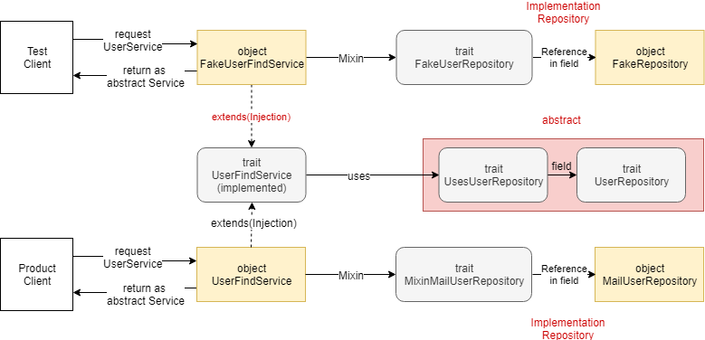

# ScalaDIPractice
ScalaでDependency Injectionを試したもの

## 使い方
IntelliJなら、

既存プロジェクトをインポート - sbt - 以後は各自の設定

によりインポートできます。

## イメージ

## 内容
`UserRepository`という抽象を、利用者である`UserFindService`にプロダクトとテスト双方からDIでどのように注入するか、試したものです。

## 参考

元となった記事

https://qiita.com/pab_tech/items/1c0bdbc8a61949891f1f

サンプルで実装してみたもの（自身の記事）

https://hiroronn.hatenablog.jp/entry/20190512/1557650524